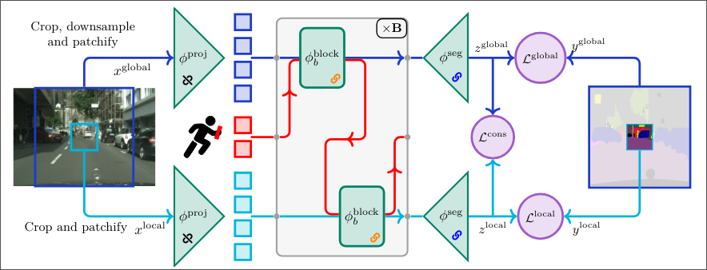

<div align="center">

# Relay Token

<a href="https://pytorch.org/get-started/locally/"></a>
<a href="https://pytorchlightning.ai/"></a>
<a href="https://hydra.cc/"></a>
<a href="https://github.com/ashleve/lightning-hydra-template"></a><br>
[](https://www.nature.com/articles/nature14539)
[](https://papers.nips.cc/paper/2020)

</div>

## Description

Current approaches for segmenting ultra‑high‑resolution images either slide a window, thereby discarding global context, or downsample and lose fine detail. We propose a simple yet effective method that brings explicit multi‑scale reasoning to vision transformers, simultaneously preserving local details and global awareness. Concretely, we process each image in parallel at a local scale (high‑resolution, small crops) and a global scale (low‑resolution, large crops), and aggregate and propagate features between the two branches with a small set of learnable relay tokens. The design plugs directly into standard transformer backbones (\eg\ ViT and Swin) and adds fewer than 2\% parameters. Extensive experiments on three ultra‑high‑resolution segmentation benchmarks, Archaeoscape, URUR, and Gleason, and on the conventional Cityscapes dataset show consistent gains, with up to 13\% relative mIoU improvement.



## Results

Using a 256x256 sliding window:

| F1 Score    | ViT  | ViT with RelayToken | Swinv2 | Swinv2 with RelayToken |
|-------------|:----:|:-------------------:|:------:|:----------------------:|
| Archaeoscape| 46.5 | 46.7                | 51.9   | **57.8**               |
| URUR        | 36.3 | 40.4                | 41.0   | **46.4**               |
| Gleason     | 33.2 | 49.1                | 48.1   | **55.5**               |
| Cityscapes  | 53.0 | 61.0                | 68.2   | **75.1**               |

## Installation

#### Conda

```bash
# clone project
git clone https://github.com/YohannPerron/RelayToken
cd RelayToken

# create conda environment and install dependencies
conda env create -f environment.yaml -n myenv

# activate conda environment
conda activate myenv
```

## How to run

The code makes heavy use of hydra for all parameters. Most experiment can simply be launch using the following command:
```bash
python src/train.py data=$DATASET model=$MODEL trainer.devices=$NUM_GPUs
```
Where `$DATASET` is one of the for dataset : archaeoscape, cityscape, gleason and urur.
And `$MODEL` is one of the model in "./config/model/", the main one being ViT_S, Swin2_S and their Relay token equipped variant: RT_ViT_S, RT_Swin2_S.

Additionally, the input size can be change by specifying the input *imageside* (size on the input image in the original image) and *imagesize* (size to which the patch is rescaled before being passed to the network)
```bash
python src/train.py data=$DATASET model=$MODEL data.imageside=X data.imagesize=Y trainer.devices=$NUM_GPUs
```
**Note:** For Archaeoscape, imageside is technically a measurement in **meters** of the length of the side of a patch. This meant when using non default imageside/imagesize, imageside should be half of imagesize for full resolution. For all other dataset imageside is expressed in pixel so this isn't an issue.

